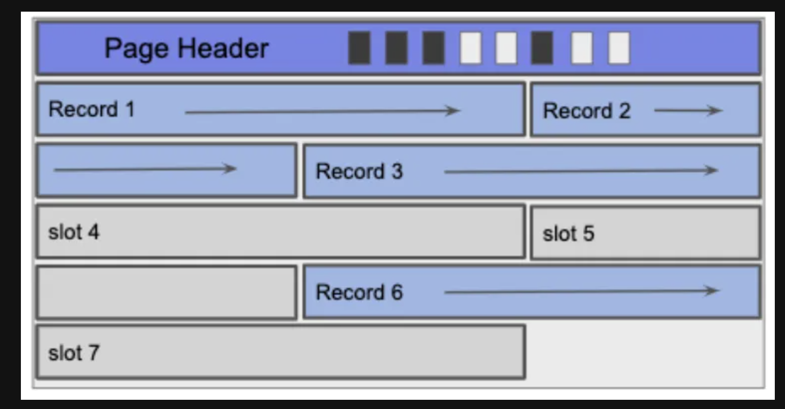
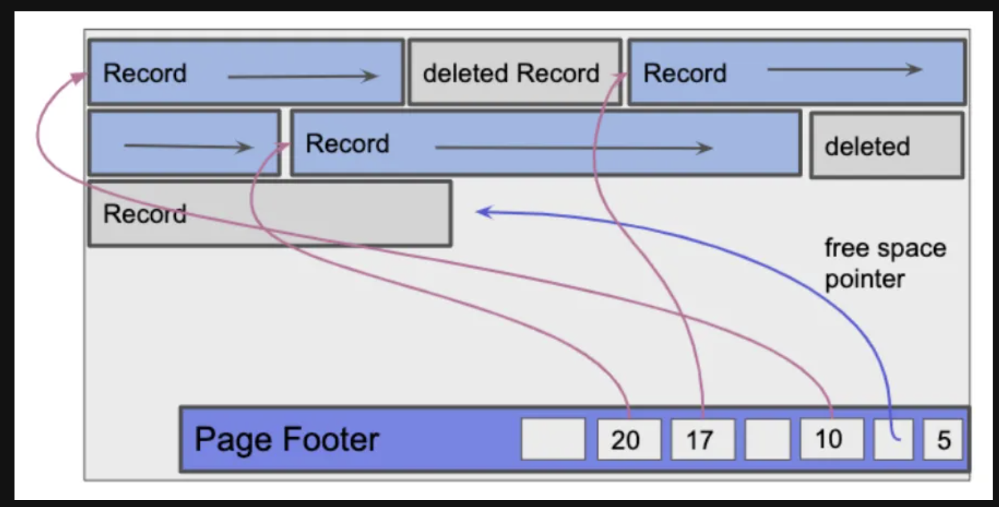

# DIS 2

## 1.True and False

(a) False, an entire page of data is read from disk.
(b) True, in SSD, write sometimes need to involve reorganization to avoid uneven wear and tear.
(c) False, no such requirement.
(d) False, need some space for free space pointer.
(e) True, in page with Fixed Length Records, we use bitmap to track the record space and empty slot space, the bitmap size is fixed.
  

In Pages with Variable Length Records
  
we use Page Footer with a direction of slots which maintain the (record offset(or pointer), record length) and a free space pointer.
**Deletion:** set the pointer and length to null

(a) Does not need a delimiter character to separate fields in the records.
(b) Compared to fixed-length record format, we need extra space for record header.
(c) Can access any field without scanning the entire record by calculating position of any field.
(d) Has compact representation of null values.

## 2. Fragmentation And Record Formats

(a) No, in fixed-length record page format, fragmentation is not an issue.
(b) Yes, it is an issue in Variable length records on a slotted page.
(c) in fixed-length record page format, bitmap has better space complex.

## 3. Record Formats

(a) only qtext is Variable length field, the minimum case itself length is 0, and the pointer is 4 bytes, for other two integer, each one take exactly 4 bytes, $\therefore $ the total record is $4+4+0+4=12 \text{ bytes}$

(b) cause we have 3 field, so it will be 3 bits in bitmap, which takes up 1 byte, for the left part, is the same as part(a), $\therefore$ total bytes is $12+1=13 \text{ bytes}$

## 4. Calculate the IOs with Linked List Implementation

(a) one step for read in header page, 2 step for scanning all the two free space page.$\therefore 2 \text{ I/Os}$
(b) 3 for find the 2nd free space page, 1 to write the record, 1 to change the previous free page pointer, 1 to move this page to the front of the full page, 2 for find the previous front of full page and link it to the new front. $\therefore 8 \text{ I/Os}$

## 5. Calculate the IOs with Page Directory Implementation

(a) each page in $B$ can hold 16 pages, so we need $ceil(54/16)= 4$ pages, so we need $4 \text{ I/Os}$ to find the last free space.

(b) 4 to find final page with free space. 1 to read its free space, 1 to write record, 1 to write back to page.$\therefore 4+1+1+1=7 \text{ bytes}$