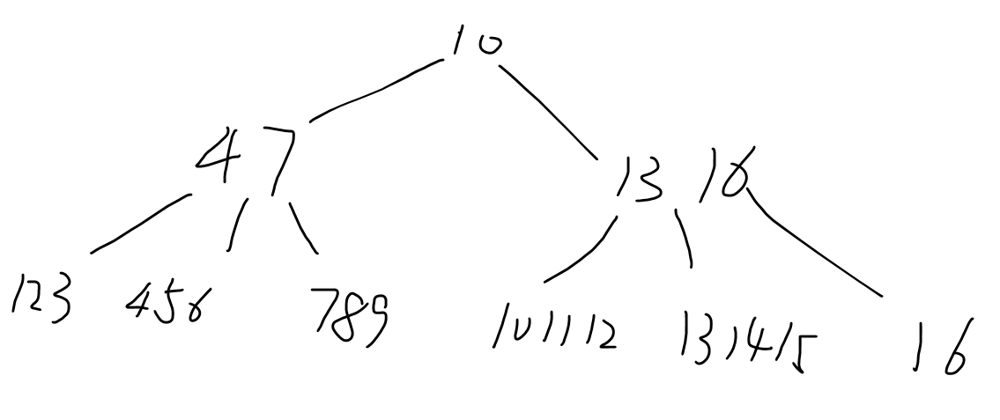

# DIS 4

## 1. Indices (B+ Trees)

(a)
For this B+ Tree, the curr_height = 2, d = 1
$\therefore $ the maximum number of record we can have in this height is $3*3*2=18$
Since we already have 6 record, $\therefore 18-6=12$ insertions.

(b)
Since the first node and its parent node are all full, so we insert 1,4,5, this will cause the root to be overflowed, which will increase the height.

## 2. Indices

(a) ???

(b) There are $12*1024/64=192$ pages in the Table. So we need 192 I/Os to read all pages.

(c) Since the B+ Tree height = 3, so we need 4 I/Os to get the wanted leaf page, and 1 I/Os to follow the reference in it to the data page, 1 I/Os to modify and rewrite back to the memory.

(d) For the worst case, every record match the requirement. So we need check all the record, which is 192.

# 3.  Bulk-Loading

The fill factor = 3/4 means for the leaves, once it be full which is 4, we need to split it in to 3 for left and 1 for right.
  

