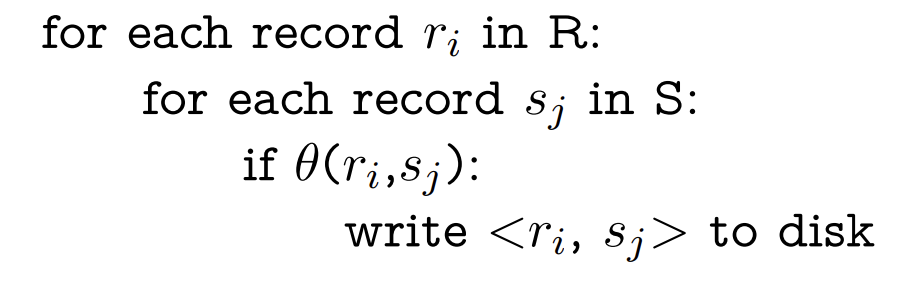
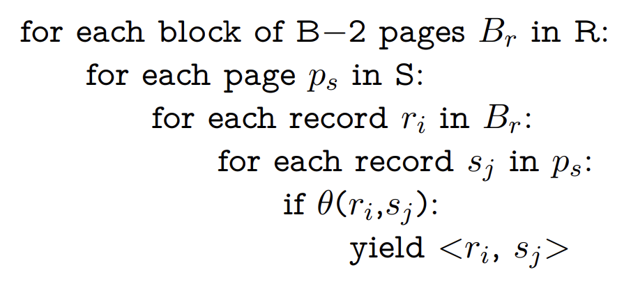
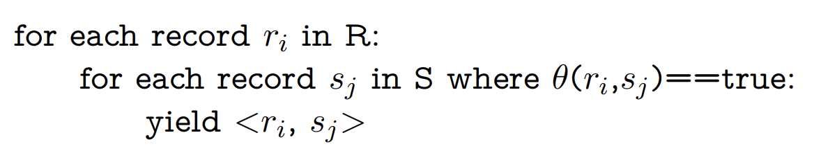

# DIS 6

## 1. Assorted Joins

(a) **simple nested loop join (SNLJ)**. You can think of it as two nested for loops:
 

$([C] \text{ for read every pages for Companies}) + (pC*[C]* [N] \text{ for each record in C, we need to check every pages in R}) \\
= 250050$

(b)**Chunk Nested Loop Join (or Block Nested Loop Join)**
  

B = 20, B-2 for C, 1 for N, 1 for output
$([C] \text{ for read every page of C}) + ([\frac{[C]}{B-2}* [N]]) \\
= 350$

(c) If we have an index on $S$ that is on the appropriate field (i.e. the field we are joining on), it can be very fast to look up matches of $r_i$ in $S$. This is called **index nested loop join**.
  
$([C] \text{ for read every page of C}) + (pC*[C]*(2+4, \text{ 2 for B+ height, 4 for there are 4 matching tuples in NYSE})) \\
= 15050$

(d)
$([C] \text{ for read every page of C}) + (pC*[C]*(2+ [\frac{4}{100}], \text{ 2 for B+ height, } [\frac{4}{100}] \text{ for clustered pages in N})) \\
=7550$

(e)
**Without Optimize:**
use Full External Merge Sort

$(2*[C]*(1+[log_{19}([C/B])])\text{ cost to sort } C) + (2*[N]*(1+[log_{19}([N/B])])\text{ cost to sort } N) + ([C] + [N], \text{ using two pointer}) \\
= 750$

**With Optimize**
after do pass 0 to both $C$ and $N$, we get $[\frac{50}{B}] = 3$ sorted runs for $C$ and $\frac{100}{B} = 5$ sorted runs for $N$, since $3+5=8 \leq B-1$, we can merge sort them now.
$(2*[C] + 2*[N] \text{ for their pass0 } + ([C] + [N] \text{ for matches})) \\
=450$

(f)
For hashing C:
pass0:

1. read $C$, $[C]=50$
2. divide to $B-1$ partitions, each contains $[\frac{[C]}{B-1}]=3$ pages, write out to disk cost $3*19 =57$

pass1:
since all partitions is less than B, no need to recurse divide.
$\therefore 19*3=57$ for read and update hash table.

$total = 50+57+57=164$

The same for N $\Rightarrow 100+[\frac{100}{19}]*19*2=328$

$\therefore 164+328=492$

## 2. Grace Hash Join

(a)
In Grace hash join, we use the smaller table to build hash table, in this case, which is T
B=10
For hashing T:
pass0:

1. read $T$, $[T]=50$
2. divide to $B-1$ partitions, each contains $[\frac{[T]}{B-1}]=6$ pages, write out to disk cost $6*9 =54$

pass1:
since current each partitions all fit in memory(B-2), no need for recurse divide.
So only require 1 partitioning phases

(b)

For C, also need divide into 9 partitions

1. read $C$, 100
2. divide to $B-1$ partitions, each contains $[\frac{[C]}{B-1}]=12$ pages, write out to disk cost $12*9 =108$

Then do native hash join:

1. for each partitions, read in T, build B-2 big hash table,
then read in C, find matches and out put
$9*(6+12)=162$

$total = 50+54+100+108+162=474$

(c)
B = 8
For hashing T:
pass0:

1. read $T$, $[T]=50$
2. divide to $B-1$ partitions, each contains $[\frac{[T]}{B-1}]=8$ pages, write out to disk cost $8*7 =56$

pass1:
each partitions is bigger than $B-2=6$, so recursively do divide
For each partitions:

1. read 8 pages.
2. divide to $B-1$ partitions, each contains $[\frac{[8]}{B-1}]=2$ pages, write out to disk cost $2*7 =14$
cost = $7*(8+14)=154$

pass2:
now all partitions fit in B-2 hash table
So require 2 partitioning phases.

(d)
For C, also need divide 2 times to get the same partitions with T
pass0:

1. read $C$, 100
2. divide to $B-1$ partitions, each contains $[\frac{[C]}{B-1}]=15$ pages, write out to disk cost $15*7 =105$

pass1:

For each partitions in pass0:

1. read 15 pages.
2. divide to $B-1$ partitions, each contains $[\frac{[15]}{B-1}]=3$ pages, write out to disk cost $3*7 =21$
cost = $7*(15+21)=252$

Then do native hash join:

1. for each partitions, read in T, build B-2 big hash table,
then read in C, find matches and out put
$7*7*(2+3)=245$

$total = 50+56+154+100+105+252+245=962$
