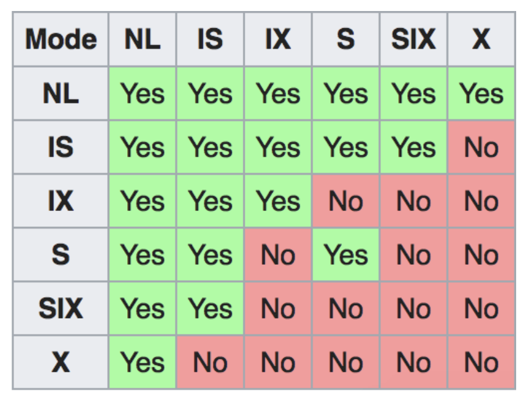

# DIS 8

## 1. Conflict Serializability

(a)
T2's write to B have to wait for T1, also T2's write to C have to wait for T3

(b)
simply follow the dependency graph will give us conflict equivalent serial schedules:
so T1, T3, T2 or T3, T1, T2

(c)
T1's write to A have to wait for T2 and T3, T2's write to B have to wait for T1 and T4.

(d)
there is a cycle between T1 and T2, so this schedule is not conflict serializable.

## 2. Deadlock

(a)
T1's S(B) have to wait for T2's X(B)
T2's X(C) have to wait for T3's S(·)
T4's X(B) have to wait for T1's S(B)
T3's X(A) have to wait for T1's S(A)
there is a cycle between T1, T2, T3, so it is deadlock.

(b)
when consider T3 wait for T1, since T1 has higher priority, we abort T3.
Also when T4 wait for T1, we abort T4.

## 3. Locking

(a) 3030
(b)
 The two rules for **2PL** are:
• Transactions must obtain a S (shared) lock before reading, and an X (exclusive) lock before writing.
• Transactions cannot get new locks after releasing any locks – this is the key to enforcing serializability through locking!
The **Strict 2PL** is the same as 2PL, except all
locks get released together when the transaction completes.

in our scheme, T2 Unlock(F), then it Lock_S(B), which against rule2.

(c)
Yes, we can move it to the end to make this 2PL

(d)
No, there still a Unlock(B) in T1

(e)
Yes, this time both Transactions released all locks together when the transaction completes.

## 4. Multigranularity Locking
  

NL: stands for no lock.
IS: Intent to get S lock(s) at finer granularity.
IX: Intent to get X lock(s) at finer granularity. Note: that two transactions can place an IX lock on the same resource – they do not directly conflict at that point because they could place the X lock on two different children! 
SIX: Like S and IX at the same time. 

(a)

* SIX on R,
* IX on R'pages, PS:[We don’t obtain a SIX because there is already an S lock on R (from
the SIX). Obtaining another S on the Page is redundant.]
* X on the updated tuples.

(b)
from the table we can see it is incompatible.

(c)

1. S or X
2. S or IS

## 5. Project Prep

See in disc8_sol

