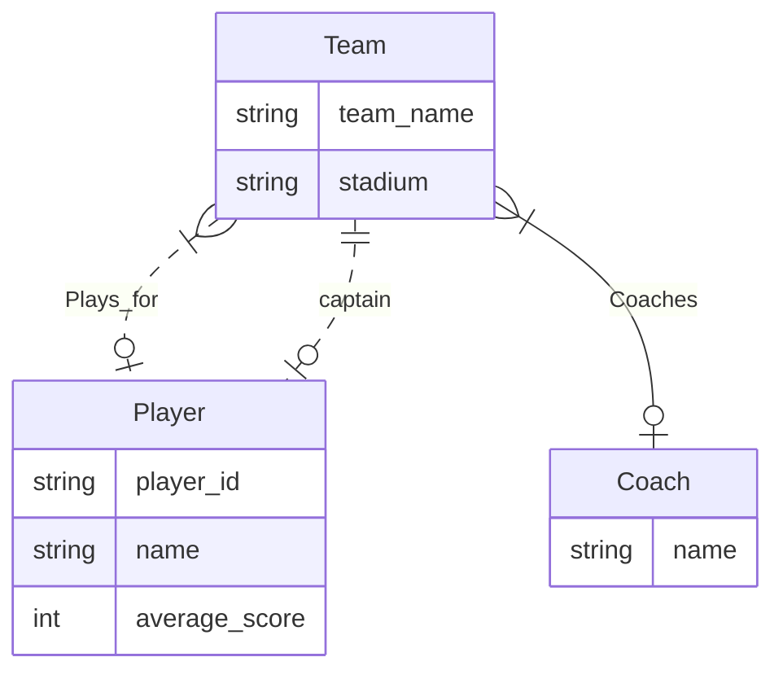

# DIS 10

## **REVIEW:**

### Some professional terms

* *Superkey* is a set of columns that determine all the columns in the table.
* *Candidate key* is a minimal set of of columns that determine all the columns in the table.
* Given a Relation R and FDs F, a FD $X \rightarrow A$ in F does not violate the BCNF constraints if either of the following conditions holds true:
    1. A ⊆ X (called a trivial FD).
    2. X is a superkey for R (implies X+ = R).

### BCNF Decomposition algorithm:

* i. Input R: Relation
* ii. Input F: FDs for $R$
* iii. $R$ = $\{R\}$
* iv. If there is a relation r ∈ R that is not BCNF and has > 2 attributes:
    * 1. Pick a violating FD $f$: $X \rightarrow A$ such that $X, A ∈$ attributes of $r$
    * 2. Compute $X+$.
    * 3. Let $R_1 = X+$. Let $R_2 = X \bigcup (r − X+)$.
    * 4. Remove $r$ from $R$.
    * 5. Insert $R_1$ and $R_2$ into $R$.
    * 6. Recompute $F$ as FDs over all relations $r ∈ R$.
* v. Repeat step 4 until necessary


## 1. ER Diagrams




## 2. Functional Dependencies

1. FDs = $\{X -> Y, Y -> Z\}$
(a) X is a set of attributes
(b) XY is a set of attributes
(c) X -> Y is a functional dependency
(d) F is a set of functional dependencies
(e) F+ is a set of functional dependencies
(f) X+ is a set of attributes
(g) Armstrong’s reflexivity axiom is an axiom

2. Relation $R = \{x,y,z\}$, 
   FDs = $\{X \rightarrow Y, XY \rightarrow YZ, Y \rightarrow X\}$, 
   $X = \{x\}, Y = \{y\}, and Z = \{z\}$

   for Table 1: None
   for Table 2: $XY \rightarrow YZ$
   for Table 3: $X \rightarrow Y, XY \rightarrow YZ$
   for Table 4: $X \rightarrow Y, XY \rightarrow YZ, Y \rightarrow X$

3. FDs = $\{ A \rightarrow B, AB \rightarrow AC, BC \rightarrow BD, DA \rightarrow C \}$ 
(a) $A+=\{A,B,C,D\}$
(b) $B+=\{B\}$,$C+=\{C\}$,$D+=\{D\}$
(c) $AB+=\{A,B,C,D\}$,$AC+=\{A,B,C,D\}$,$AD+=\{A,D,C,B\}$
(d) $BC+=\{B,C,D\}$
(e) $BD+=\{B,D\}$
(f) $CD+=\{C,D\}$
(g) $BCD+=\{B,C,D\}$

4. base on Q3:
Suprekey(but not candidate keys): $AB+,AC+,AD+$
Candidate-key: $A+$
neither: other

## 3. Normal Forms

Decompose $R = \{ABCDEFG\}$ into BCNF, given the functional dependency set: FDs = $AB →
CD, C → EF, G → A, G → F, CE → F$.
```
step1:
R = {ABCDEFG}
r = ABCDEFG
AB+ = {A,B,C,D,E,F}
f = AB -> CD violating BCNF since AB is not a superkey nor is CD ⊆ AB.
R1 = ABCDEF, R2 = AB∪G = ABG
R = {ABCDEF, ABG}
```

```
step2:
R = {ABCDEF, ABG}
r = ABCDEF
C+ = {C,E,F}
f = C -> EF violating BCNF since C is not a superkey nor is EF ⊆ C.
R1 = CEF, R2 = C∪ABD = ABCD
R = {ABG,CEF,ABCD}
```

```
step3:
R = {ABG,CEF,ABCD}
r = ABG
G+ = {G,A}
f = G -> A violating BCNF since F is not a superkey nor is A ⊆ G.
R1 = GA, R2 = G∪B = GB
R = {CEF,ABCD,AG,BG}
```

Final relations: $ABCD, CEF, AG, BG$.