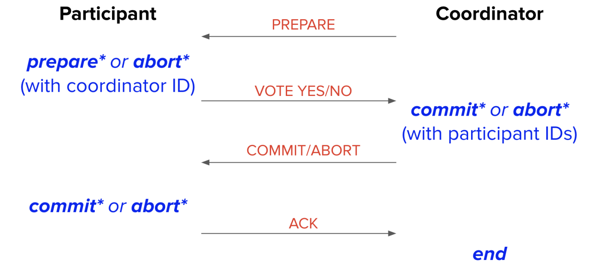

# DIS 12

## REVIEW

### Two Phase Commit (2 PC)

1. First phase is the preparation phase:
   * 1. Coordinator sends prepare message to participants to tell participants to either prepare for commit or abort.
   * 2. Participants generate a prepare or abort record and flush record to disk.
   * 3. Participants send yes message to coordinator if prepare record is flushed or a no message if abort record is flushed.
   * 4. Coordinator generates a commit record if unanimous yes votes or an abort record otherwise and flushes record to disk.
2. Second phase is the commit/abort phase:
   * 1. Coordinator broadcasts (sends message to every node in the db) result of the commit/abort vote based on flushed record.
   * 2. Participates generate a commit or abort record based on the received vote message and flush record to disk.
   * 3. Participants send an ACK (acknowledgement) message to the coordinator.
   * 4. Coordinator generates an end record once all ACKs are received and flushes the record sometime in the future.

  

### Distributed Recovery

Many cases, see in nodes15.

## 1. Two Phase Commit with Logging

1. 
   * For first phase: $30+10+15+10=65$.
   Coordinator sends prepare message(30ms) + Participant generates and flushes prepare record(10ms) + max time it takes a participant to send a Yes message(15ms) + Coordinator generates and flushes commit record(10ms).
   * For second phase: $30+10+15+10=65$
   Coordinator sends commit message(30ms) + Participant generates and flushes commit record(10ms) + max time it takes a participant to send an ACK message(15ms) + Coordinator generates and flushes end record(10ms).

2. 
   This is the situation that Participant is recovering, and sees a prepare record:
   So the recovery process must ask the coordinator whether a commit happened, the coordinator will respond with the commit/abort decision, and the participant resumes 2PC from phase 2.

3. 
   (a): the same as problem 2.
   (b): this is the case that Participant2 is recovering, and sees a phase 1 abort record:
      – Without presumed abort: Send “no” vote to coordinator.
      – With presumed abort: Do nothing! (Coordinator will already presume abort anyway.)

4. this is the case that coordinator is recovering and sees nothing.
   (a): with presume abort, no log record means abort. so the coordinator will abort the transaction locally (not sending an ABORT message) by undoing its actions, if any, using the UNDO log records, and writing an abort record.
   (b): with presume abort, this participant knows that the transaction will be aborted, so it aborts the local effects of the transaction.
   (c): cause this participant not received vote message from coordinator, it will wait and do nothing, if we use timeout and thus notice the crash of coordinator, the participant will hands out the transaction over to the recovery process and received the answer of 'abort'(because of (b)), the participant will then abort the transaction.
   (d): nothing changes since we use presume abort.
